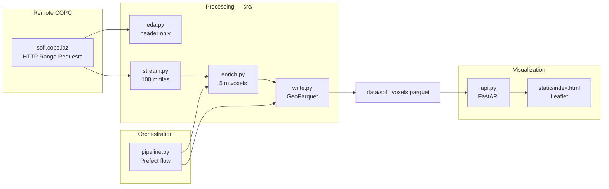

# SoFi COPC LiDAR Pipeline

Stream a remote **Cloud Optimized Point Cloud (COPC)** for SoFi Stadium, aggregate points into **3D voxels**, write structured **GeoParquet**, and explore the results through a **FastAPI + Leaflet** viewer.

**Source data:** [SoFi Stadium COPC on S3](https://s3.amazonaws.com/hobu-lidar/sofi.copc.laz)  
**CRS:** EPSG:32611 (WGS 84 / UTM zone 11N, metres)

---

## Quick start — visualize existing output

If you only want to explore the results, use the included enriched GeoParquet (`data/sofi_voxels.parquet`, ~80k voxels). No pipeline run required.

```bash
git clone git@github.com:Taenja/data-engineering.git
cd data-engineering

python3 -m venv venv
source venv/bin/activate
pip install -r requirements.txt

cd src

# Optional: inspect the included GeoParquet before starting the viewer
python verify.py

uvicorn api:app --reload --port 8000
```

Open [http://127.0.0.1:8000/](http://127.0.0.1:8000/) in your browser.

The viewer supports:

- **Color by:** `classification_mode`, `intensity_mean`, `point_count`, `point_density`, `z_mean`
- **ASPRS classification legend** when coloring by mode (Ground, Building, Vegetation, etc.)
- **Summary stats** and metric ranges in the sidebar
- **Leaflet basemap** with voxels reprojected to WGS84 for display

To point the API at a different file:

```bash
VOXEL_PARQUET=/path/to/other.parquet uvicorn api:app --reload --port 8000
```


## Full pipeline — run from scratch

Running the full enrichment over the entire dataset takes **approximately 15 minutes** (network + processing dependent). For a quick smoke test, limit tiles with `--max-tiles`. 

### Step 1 — Clone the repository

```bash
git clone git@github.com:Taenja/data-engineering.git
# or: git clone https://github.com/Taenja/data-engineering.git
cd data-engineering
```

### Step 2 — Create a virtual environment

```bash
python3 -m venv venv
source venv/bin/activate   # Windows: venv\Scripts\activate
```

### Step 3 — Install dependencies

```bash
pip install -r requirements.txt
```

### Step 4 — Start Prefect (optional but recommended)

The pipeline is orchestrated with [Prefect](https://www.prefect.io/). Start the local server in one terminal:

```bash
prefect server start
```

Prefect UI: [http://127.0.0.1:4200](http://127.0.0.1:4200)

### Step 5 — Run the pipeline 
NOTE: Give custom output path to save the file, in case the pipeline fails the enriched data/sofi_voxels.parquet can be used for visualisation.

In a second terminal (with the venv activated):

```bash
cd src

# Full extent (~15 min)
python pipeline.py

# Smoke test — first N tiles only
python pipeline.py --max-tiles 3

# Custom output path
python pipeline.py --output ../data/my_voxels.parquet
```

**Output:** `..data/my_voxels.parquet` — one row per 5×5×5 m voxel with aggregated metrics.

Prefect logs each task with duration, retries, and coverage stats. Follow the run link printed in the terminal to inspect the flow in the Prefect UI.

### Step 6 — Visualize

```bash
cd src
uvicorn api:app --reload --port 8000
# to use your custom file -
VOXEL_PARQUET= ../data/my_voxels.parquet uvicorn api:app --reload --port 8000
```

After re-running the pipeline, click **Reload data** in the viewer or `POST /reload` to refresh the in-memory cache.

---

## Verify output

Output is checked in two ways:

### 1. Automatic — Prefect `verify_output` task

When you run `python pipeline.py`, the final Prefect task reloads the GeoParquet, logs the row count, and confirms the file was written correctly. Check the terminal output or the Prefect UI (`http://127.0.0.1:4200`) for the `verify_output` task result.

### 2. Manual — `verify.py` (no pipeline run required)

Use this to inspect the **already generated** file at `data/sofi_voxels.parquet` (or any other path):

```bash
cd src

# Default: ../data/sofi_voxels.parquet
python verify.py

# Custom path or more sample rows
python verify.py ../data/sofi_voxels.parquet
python verify.py --rows 20
```

The script prints file metadata, schema, sample rows, geometry preview, numeric summaries, ASPRS class breakdown, spatial bounds, and top voxels by point count.

**Expected signals for a full run:**

| Check | Expected |
|-------|----------|
| Rows | ~80,000 voxels |
| CRS | EPSG:32611 |
| Schema | `point_count`, `z_mean`, `classification_mode`, `geometry`, … |
| Geometry | Point (3D centroids) |
| Nulls | No nulls in key metric columns |

You can also verify via the API: `curl http://127.0.0.1:8000/stats` (after starting `uvicorn`).

---

## Approach

I scoped the task around **voxel-grid downsampling with statistical profiling** (one of the suggested enrichment paths): stream COPC tiles, aggregate points into 5 m voxels, and write GeoParquet. The pipeline is split into small modules (`eda` → `stream` → `enrich` → `write`) orchestrated by Prefect, with a FastAPI viewer on top.


### 1. Exploratory data analysis (`eda.py`)

The first step reads **only the COPC header** over HTTP — not the full point cloud — to inspect:

- Coordinate reference system (EPSG:32611, projected metres)
- Spatial extent (min/max bounds)
- Point count
- LAS point format and available dimensions (X, Y, Z, intensity, classification, …)

```bash
cd src && python eda.py
```

This confirms the data is suitable for tiled streaming and identifies which columns to aggregate downstream.

### 2. Tiled streaming (`stream.py`)

The full area is divided into **100×100 m XY tiles**. For each tile, the COPC reader issues **HTTP Range Requests** and loads only points inside that bounding box — keeping memory bounded.

- RSS (resident set size) is logged per tile to demonstrate memory stays stable
- A tile inspection helper prints sample values (intensity, classification codes, etc.)
- Classification values follow the **ASPRS LAS standard** (e.g. 2 = Ground, 6 = Building)

```bash
cd src && python stream.py --max-nonempty-tiles 3
```

### 3. Voxel enrichment (`enrich.py`)

Points within each streamed tile are binned into **5×5×5 m voxels** (similar to pixels in 2D raster data). This is analogous to **zonal statistics**: all points falling in a voxel are summarized into one record.

**Per-voxel metrics:**

| Column | Description |
|--------|-------------|
| `point_count` | Number of LiDAR returns in the voxel |
| `point_density` | Points per m³ |
| `intensity_mean` | Mean return intensity |
| `z_mean`, `z_std`, `z_min`, `z_max` | Elevation statistics |
| `classification_mode` | Most common ASPRS class in the voxel |

Running aggregates are kept in memory (counts, sums, histograms) — **raw points are never stored** for the full dataset.

### 4. GeoParquet export (`write.py`)

Each voxel becomes a **3D point geometry** at its centroid (`voxel_x`, `voxel_y`, `z_mean`). The table is written as GeoParquet with CRS EPSG:32611.

For production, the same write step can target **S3** (e.g. `s3://bucket/sofi_voxels.parquet`) via GeoPandas / PyArrow — the current task saves locally for simplicity.

### 5. Prefect orchestration (`pipeline.py`)

The end-to-end flow is:

```
validate_source → enrich_voxels → save_geoparquet → verify_output
```

| Task | Role |
|------|------|
| `validate_source` | Open remote COPC, log extent, tile count, point count |
| `enrich_voxels` | Stream tiles and build voxel metrics |
| `save_geoparquet` | Bulk-write enriched rows to Parquet |
| `verify_output` | Reload file and confirm row count |

Tasks have retries and structured logging (tiles processed, points queried, coverage flags).

### 6. Visualization API (`api.py` + `static/index.html`)


**FastAPI** serves:

- `/` — Leaflet HTML viewer
- `/stats` — dataset summary and classification breakdown
- `/voxels` — filtered, sorted queries
- `/voxels/{voxel_id}` — single voxel lookup
- `/viz/sample` — downsampled points for the map (reprojected to EPSG:4326)
- `/health`, `/reload`

### AI tools (Cursor)

I used **Cursor** as an AI-assisted coding agent throughout. My role was to define the architecture, data flow, and enrichment logic; AI helped me move faster on implementation.

| Area | How AI was used | What I did myself |
|------|-----------------|-------------------|
| **Research** | Understanding voxel grids, COPC streaming, and ASPRS LAS point classification | Chose voxel downsampling over ground extraction / clustering based on the task and dataset |
| **Code structure** | Suggesting module layout, function signatures, and README sections | Decided the tile → voxel → Parquet pipeline and reviewed all logic |
| **Prefect** | Drafting `@task` / `@flow` boilerplate, retries, and logging patterns | Wired tasks to my `enrich` and `write` modules; validated coverage stats in logs |
| **Visualization** | FastAPI endpoints in `api.py` and the Leaflet HTML viewer — including ASPRS colour scales and categorical vs continuous legends | I have used Leaflet before; Cursor made integrating it with FastAPI and styling the viewer much faster |
| **Boilerplate scripts** | Faster first drafts of `verify.py`, CLI argparse, and docstrings | Ran and corrected outputs (RSS checks, row counts, CRS, metric ranges) |

**Manually verified:** COPC header via `eda.py`, bounded memory via RSS logs in `stream.py`, full pipeline run against the live S3 URL, GeoParquet reload via Prefect `verify_output` and `verify.py`, and map/API spot checks in the viewer.

Also to clean up the README.md file and make it professional :)

---

## Pipeline architecture



---

## Project structure

```
data-engineering/
├── data/
│   └── sofi_voxels.parquet      # enriched output (sample included)
├── docs/
│   └── images/
│       └── viewer_screenshot.png  # optional screenshot for README
├── src/
│   ├── eda.py                   # header-only EDA
│   ├── stream.py                # tiled COPC streaming + RSS logging
│   ├── enrich.py                # voxel aggregation
│   ├── write.py                 # GeoParquet read/write
│   ├── pipeline.py              # Prefect orchestration
│   ├── verify.py                # standalone GeoParquet verification
│   ├── api.py                   # FastAPI consumer
│   └── static/
│       └── index.html           # Leaflet viewer
├── requirements.txt
└── README.md
```

---

## Configuration

Key parameters (defined in `stream.py` and `enrich.py`):

| Parameter | Default | Description |
|-----------|---------|-------------|
| `URL` | SoFi COPC S3 URL | Remote COPC source |
| `TILE_SIZE` | 100 m | XY query window for streaming |
| `VOXEL_SIZE` | 5 m | Voxel edge length (5×5×5 m cube) |
| `RESOLUTION` | `None` | COPC LOD; `None` = full resolution |
| `CRS` | EPSG:32611 | Output coordinate system |
| `DEFAULT_OUTPUT` | `data/sofi_voxels.parquet` | Default write path |

---

## Output schema

Each row in `sofi_voxels.parquet` represents one voxel:

| Column | Type | Description |
|--------|------|-------------|
| `voxel_id` | string | Grid key `ix:iy:iz` |
| `voxel_ix`, `voxel_iy`, `voxel_iz` | int | Voxel grid indices |
| `voxel_x`, `voxel_y`, `voxel_z` | float | Voxel origin (m, UTM) |
| `point_count` | int | Points in voxel |
| `point_density` | float | Points per m³ |
| `intensity_mean` | float | Mean intensity |
| `z_mean`, `z_std`, `z_min`, `z_max` | float | Elevation stats (m) |
| `classification_mode` | int | ASPRS modal class |
| `geometry` | Point Z | Centroid (x, y, z_mean) |

**ASPRS classes used in the viewer:** 0 Never classified, 1 Unclassified, 2 Ground, 3–5 Vegetation, 6 Building, 7 Low point, 9 Water, 17 Bridge deck.

---

## API reference

| Method | Endpoint | Description |
|--------|----------|-------------|
| GET | `/` | HTML map viewer |
| GET | `/health` | Data availability check |
| GET | `/stats` | Row count, bounds, metric summaries, class histogram |
| GET | `/voxels` | Filter/sort voxels (`min_x`, `max_x`, `min_density`, `sort_by`, …) |
| GET | `/voxels/{voxel_id}` | Single voxel record |
| GET | `/viz/sample` | Map sample (`limit`, `color_by`) |
| POST | `/reload` | Clear cache after pipeline re-run |

Interactive docs: [http://127.0.0.1:8000/docs](http://127.0.0.1:8000/docs)

---

## Design notes

- **Memory-bounded streaming:** Tiles are processed one at a time; points are discarded after aggregation. Peak RSS is logged throughout enrichment.
- **COPC over HTTP:** No full file download — only header, index, and tile-specific byte ranges are fetched.
- **Incremental aggregation:** Voxel stats use running sums and class histograms, not full point lists.
- **Separation of concerns:** `stream`, `enrich`, `write`, `pipeline`, and `api` are independent modules; each can be run standalone for development.
- **Production extensions:** S3 output, Prefect Cloud, and coarser `RESOLUTION` for faster previews are straightforward next steps.

---